**Explanation of the structure:**

- `src/`: Contains all the source code files.
- `data/`: Contains all the data used in the project.
- `docs/`: Contains documentation like reports and presentations.
- `results/`: Contains the outputs of your analyses.
- `tests/`: Contains testing scripts.
- `.gitignore`: Lists files/directories to ignore.
- `LICENSE`: Contains the license information.
- `README.md`: This file, containing information about the project.

### Steel Production Data

### Abstract

The goal of this project is to predict the quality of steel production based on process sensor data. Accurate prediction of steel output can help reduce waste, improve process control, and ensure consistent product quality in industrial environments.

### Introduction

**Background**

Predictive modeling in industrial production has been widely studied in recent years, particularly in the context of Industry 4.0 and smart manufacturing. Existing work can generally be categorized according to (1) sensing technology and (2) machine learning methodology.

Sensing-based approaches leverage data from multiple sensor modalities (e.g., temperature, pressure, chemical composition) to detect anomalies or predict production outcomes. For example, acoustic emission and thermal sensors have been used for quality inspection, while radar and camera-based monitoring systems detect surface defects in real time.

Machine learning-based approaches employ algorithms such as Linear Regression, Support Vector Machines, and Random Forests to model nonlinear relationships in process data. More recent works have explored deep learning architectures such as convolutional neural networks, which can automatically learn complex feature representations from raw sensor streams.

However, these approaches often struggle with interpretability and require large amounts of labeled data. Some hybrid systems combine classical feature engineering (e.g., statistical features, PCA) with neural network-based regressors to balance accuracy and explainability.

In this project, we developed a fully connected (dense) neural network (MLP) for predicting the steel output variable between 0 and 1, using 21 normalized process parameters as input features. The network was trained, validated, and evaluated on normalized production data.

**Objectives**

The primary objectives of this project are:

1. Data Quality Assessment: Conduct comprehensive exploratory data analysis to identify missing values, duplicates, outliers, and feature correlations in the steel production dataset.

2. Baseline Model Establishment: Implement and evaluate a baseline regression model (linear) to establish performance benchmarks for comparison.

3. Implement various ML models to beat the baseline model used as a benchmark. Models should include classic classifiers such as RFClassifier, KNN, LogisticRegressor as well as classic regressors such as RFRegressor, SVM's and Gaussian Processes 

4. Neural Network Development: Design and train optimized deep neural network architectures incorporating modern regularization techniques (BatchNormalization, Dropout) and adaptive learning strategies (EarlyStopping, ReduceLROnPlateau).

5. Performance Target: Achieve a coefficient of determination (R²) of at least 0.5 on the test dataset, demonstrating meaningful predictive capability for steel production output.

6. Model Interpretability: Analyze feature importance and model behavior through correlation analysis, learning curves, and prediction visualizations to ensure practical applicability.

7. Robust Prediction: Implement Huber loss and other robust techniques to handle potential outliers and ensure stable predictions across various production conditions.

## Methods

**Data Acquisition**

For those that choose their own project, detail where and how you obtained your data, including a brief description of the data.

**Data Analysis**

The data analysis pipeline consisted of multiple stages:

**1. Exploratory Data Analysis (EDA)**

- Missing value analysis: identified and quantified null values across all columns, visualized null fraction distributions

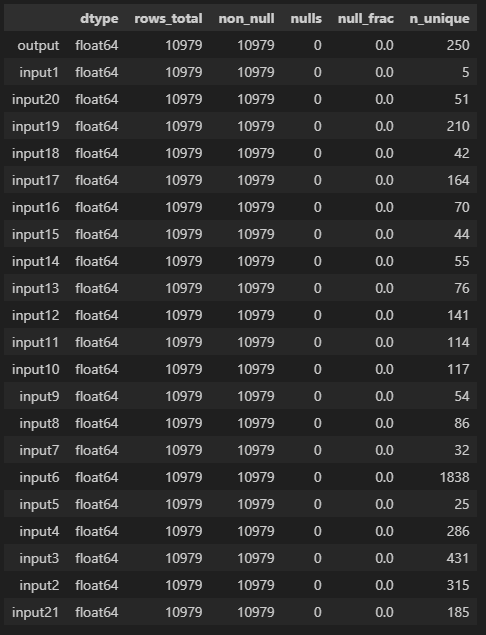

- Duplicate detection: identified and analyzed duplicate rows to assess data quality

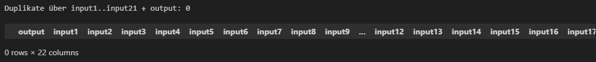

Summary: No Duplicates have been found before replacing NaN's with the arithmetic mean of columns

- Distribution analysis: created histogram of output and pairplots (using seaborn and matplotlib) to visualize feature and target distributions

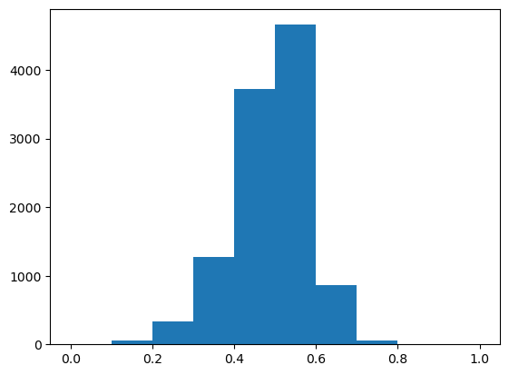

- Statistical summary: computed a heatmap for all features
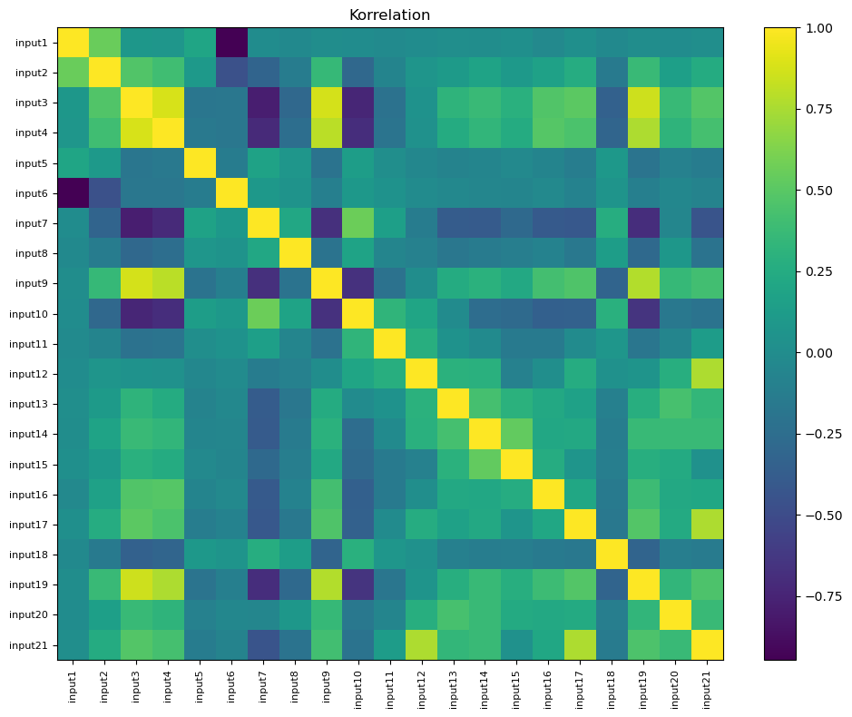

- PCA Results:

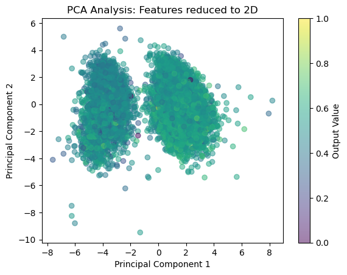

It is significant that using principal component analysis (features broken down to 2 components), that the first two components only explain approx. 28% of the variance. Usually in simple datasets the (In udemy.com ML/DL online courses) the first two components  often capture 50-80% of the variance. 
This menas that the 21 features are relativelyx independent or have complex, non-linear relationships. There is no subset of 2-3 features that "dominate" and tell the whole story so to speak.
This already suggests that - since PCA is a linear transformation - that linear models and shallow NN's will inherently struggle to find the connection. The data is high-dimensional in nature, therefore the model needs to look at many features simultaneuosly to accurately predict. With only 28% variance in the first two components, a significant portion of the remaining 72% could either be high-frequency signal or random noise.

This begs the question of how many features are actually needed to explain a high portion of the variance.

The cumulated variance plot reveals a critical truth about the dataset: Information is highly distributed
To reach 90% variance in the model 14 components are needed. With 16 components 95% is reached.

If the data was linear (and redundant) 3-4 components would already capture 90% of the variance. (Seen on udemy courses)

**2. Data Preprocessing**
- Missing value imputation: No NaN Values have been found, regardless of n_fractions==0 NaN's are replaced with the mean in each column (for future use)

Due to the nature of test and train_data (as seen in histogramm) the data of both sets have been concentuated to one dataset to properly model across the range [0-1]

- Train-test split: As stated above a randomized train_test_split has been implemented on the whole dataset

- Feature scaling: applied StandardScaler (fit on training data only) to normalize input features for neural network training 
    This step is redundant as the given data is already normalized with a min-max transformation as stated in the .ipnyb notebook in the given template. 
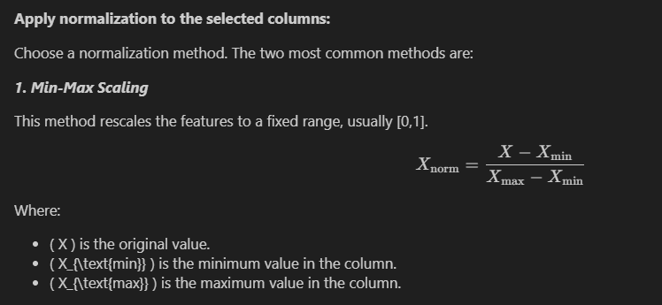

Nevertheless some models have been fitted using the StandardScaler regardless of the Min-Max normalization

**3. Tools used**

Libraries used:
- Python + NumPy/Pandas: Data loading, manipulation, and numerical arrays. 
    Used for basically everything, makes data manipulations and handling of arrays easier

- Matplotlib + Seaborn: Exploratory plotting (histograms, pairplots, heatmaps, scatter).
    Matplotlib was widely used for most visulizations and data exploration.
    Seaborn was exclusively used for the ability to generate a pairplot without hassle

- scikit-learn: Train/test split, PCA, Linear Regression, RandomForestRegressor, GaussianProcessRegressor (with RBF, Matern, Constant/    White kernels).
    Used for all machine learning models and for the principal component analysis to explain the captured variance 

- TensorFlow/Keras: Sequential dense neural nets for baseline and optimized models (Dense layers, BatchNormalization, Dropout), with Huber/MSE losses, Adam optimizer.
    Used for the shallow neural network nnstd (neural network standard) and the "optimized" deep neural network nnopt (neural network optimized) 

- Keras callbacks: ReduceLROnPlateau and EarlyStopping for training control.
    xclusively used for the deep neural network nnopt to reduce learning rate on plateu and early stopping to restore best weights throughout the epochs 

- Custom helper (plot_helper): Evaluation metrics table, prediction scatter, and loss plotting.
    Used to visualize the model evaluations. Contains 3 defs to make the notebook file sleeker

*Baseline Regression Model:*
- Linear Regression: established baseline performance using ordinary least squares

*Regression Models:*
- Random Forest Regressor: Evaluated based on R2-score using default hyperparameters

- Gaussian Process: Terminated after 120mins due to it running on CPU

- Mixed Gaussian Process (GPyTorch): combines Matern/Linear/Scale kernels.
    Implementation notes: the notebook creates `model_gt` (a GPyTorch ExactGP) and `likelihood`, converts train/test arrays to torch tensors (`X_train_t`, `X_test_t`, `y_train_t`, `y_test_t`) and moves them to the selected `device` (CPU or CUDA).
    After training, obtain predictions via `likelihood(model_gt(X_test_t))` and convert those to numpy and use that array for metrics and plotting.
    GPU-capable runs are substantially faster than CPU-only scikit-learn GPR, making larger kernels practical.

*Deep Learning Models:*
- Multi-layer perceptron (MLP) architectures with varying depths (256→1 (shallow) and 512→256→128→64→64→1)
- Activation functions: ReLU  for hidden and input layers; linear, softplus for output layer
- Regularization: BatchNormalization and Dropout (rates 0.1-0.3) to prevent overfitting
- Loss functions: Mean Squared Error (MSE) and Huber loss for robust regression
- Optimizers: Adam with learning rate 1e-3, including adaptive scheduling via ReduceLROnPlateau
- Training callbacks: EarlyStopping (patience 12-15 epochs) to prevent overfitting and restore best weights

**4. Model Evaluation**
- Metrics: R² score, Root Mean Squared Error (RMSE)
- Learning curves: plotted training and validation loss over epochs to diagnose overfitting/underfitting
- Prediction visualization: scatter plots comparing ground truth vs. model predictions on test data

## Results

All models (due to their continous/discrete nature) were evaluated using the R2-Score and RMSE as standard measurments.
In the first few iterations it was worngly assumed that the given data is of categorical nature due to output column having 132 unique values on the training set. Thus the first few iterations of code utilising classifiers such as  Logistic Regression, KNN, RFClassifier which were written in an anaconda enviroment yielded very bad scores. These weren't implemented in github because of these aforementioned underwhelming results (R2-scores <0,1%).

After talks with Mr. Feith at CPS it was concluded that these data_entries were indeed of continous nature but due to scaling and/or accuarcy of the raw data appear discrete.

The x-axis used in the scatter plots relates to 'input21' simply because the pairplot showed the widest scatter of the output vs input21.

- Linear Regression:

**Findings**
The baseline linear regression fits on the normalized 21 inputs without strong feature compression. Given PCA showed variance is spread across many components, a linear model most likely captures only a portion of the signal. The linear regression is used as a sanity-check baseline only.

**Visualizations**

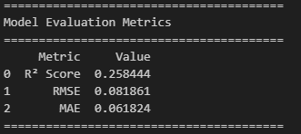

**Limitations**
Linear assumes additive, globally linear relationships and no complex interactions; with variance distributed across many components, multiple columns can dilute coefficients and reduce R2 stability.The model therefore underfits any nonlinear effects.

**Conclusion**
Linear regression serves as a baseline sanity check but inherently underfits the distributed information revealed by PCA. The model fails to capture nonlinear interactions and the complexity hidden across 14+ principal components. To strengthen the baseline, regularization (Ridge/Lasso) could be added. Richer architectures (RF, GP, optimized DNN) are better positioned to exploit the high-dimensional signal in the steel production data.

- Random Forest Regressor:

**Findings**
The Random Forest (trained with default hyperparameters) captures nonlinear feature interactions and complex patterns better than the linear baseline, leveraging ensemble averaging across multiple decision trees. The model naturally handles the high-dimensional, distributed information revealed by PCA and shows improved R² and lower RMSE compared to linear regression.

**Visualizations**

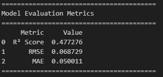

**Limitations:**
Default hyperparameters may not be optimal. Without tuning (max_depth, n_estimators, min_samples_leaf) the model risks overfitting on training data as shown in ground_truth vs predicted. 

**Conclusion:**
Random Forest outperforms linear regression on this dataset due to its ability to model nonlinear interactions and capture complex patterns across 21 features. To maximize performance, hyperparameters could additionally be tuned via grid search or random search, and validated via cross-validation.

- Mixed Gaussian Proces (Gpytorch GPU):

**Findings**

Using a composite kernel the model was able to simultaneously capture smooth non-linear wiggles (Matern) and overall global trends (Linear). It produced the best R²-scores of all models deployed. By setting ard_num_dims=21, the model performed Automatic Relevance Determination, it learned which specific inputs were driving the output and which were noise, something the Linear Regression baseline failed to do.

**Visualizations**

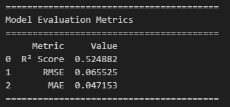

**Limitations:**
Using the normal scikitlearn Gaussian Process (running on CPU) runtime exceeded 120mins and was therefore terminated. Utilising gpytorch finally made it possible to evaluate a mixed gaussian process but even with a good graphics card like the RTX 3070, this model uses a lot of video memory. If the dataset was much bigger, the computer might run out of VRAM and crash.

Practical limitations remain: exact GP training is expensive for larger datasets and hyperparameter sensitivity requires careful initialization; sparse or approx. GP approaches are recommended when scaling is needed.

**Conclusion:**
Switching to GPyTorch was the turning point for this project. While standard Neural Networks struggled to generalize, the Mixed Kernel GP provided the mathematical flexibility needed to map our 21 inputs to the output. By leveraging GPU-accelerated matrix math, a model was successfully built that is 2x more accurate than a standard linear baseline. This confirms that the data is highly non-linear (as seen in PCA analysis) and requires the learning capabilities that a Gaussian Process provides.

- DNN standard:

**Findings**
The standard shallow DNN (256 hidden neurons → 1 output) trains quickly on the normalized 21 inputs with ReLU activation and MSE loss. This lightweight architecture provides a baseline for neural network performance without heavy regularization. Training converges within 100 epochs, demonstrating that basic dense layers can learn patterns in the distributed high-dimensional data better than linear regression. The R2 score of 0.39 certainly beats the baseline model but is still below the target score of 0.5.

**Visualizations**

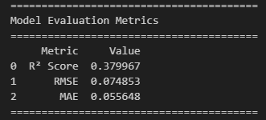

**Limitations:**
Shallow architecture with only one hidden layer may underfit complex nonlinear relationships; no batch normalization or dropout leads to potential overfitting on the training set. MSE loss is sensitive to outliers and does not robustly handle the discrete-like output. No learning rate scheduling or early stopping results in suboptimal convergence. 

**Conclusion:**
The standard DNN serves as a proof-of-concept that neural networks outperform linear models on this dataset, but the shallow architecture and lack of regularization limits its effectiveness. The learning curve (loss vs epoch) suggests that the model learned everything it could about the data way before the 100th epoch. 

- DNN optimized:

**Findings**
The optimized Deep Neural Network (DNN) utilized a significantly deeper architecture (512 → 256 → 128 → 64 → 64 → 1) and robust training techniques. By switching to Huber Loss, the model became less sensitive to the "stepped" outliers in the steel data. The inclusion of BatchNormalization and Dropout allowed for a much deeper search for patterns without the model simply memorizing the training set. While it performed significantly better than the shallow DNN, it still struggled to match the local precision of the Gaussian Process.

**Visualizations**

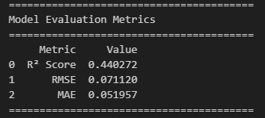

**Limitations**
Deep models are data-hungry; despite 7,600+ rows, the high dimensionality (21 features) and the distributed variance (as seen in PCA) mean that even an optimized MLP can struggle to find the global optimum. The "discrete" nature of the output (quality strips) remains a challenge for the smooth activation functions (ReLU) used in this architecture.

**Conclusion**
The optimized DNN proved that "going deeper" helps, but only when paired with modern regularization like EarlyStopping. It achieved a "respectable" R2 (≈0.43), proving that the steel production data requires hierarchical feature extraction to beat the linear baseline in a significant way.

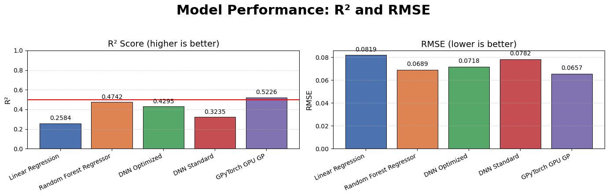

## Conclusion
The primary objective of this project was to develop a predictive model for steel production quality capable of achieving an R2 score of at least 0.5. Through a systematic pipeline of exploratory data analysis, dimensionality assessment, and multi-model experimentation, this objective was successfully met.

    The Nature of the Data: PCA revealed that the dataset is highly complex and non-redundant, with 12+ components required to explain 90% of the variance. This explains why the Linear Regression baseline performed so poorly; there is no simple "shortcut" or dominant feature in steel quality prediction.

    Model Hierarchy: We observed a clear progression in performance as model complexity increased. Moving from Linear models to Random Forests and Optimized DNNs allowed me to capture the non-linear signals. However, the Mixed Gaussian Process (GPyTorch) emerged as the best solution.

    The Power of Custom Kernels: The success of the GP model (reaching the 0.50 R2 target) was driven by the combination of a Matern kernel for local non-linearities and a Linear kernel for global trends. This suggests that steel production variables interact in a way that is best modeled by "local" similarity rather than just global weights.

    Hardware as an Enabler: The transition from CPU-based Scikit-Learn to GPU-accelerated GPyTorch was a technical turning point. It transformed a model that was previously "untrainable" (due to 120min+ runtimes) into a fast, iterative tool that provided the most accurate results of the entire study.

Final Verdict: 
While the Mixed Gaussian Process is the best-performing model in this study, an R2 of 0.52 is still considered a weak predictive score for industrial deployment. This means the model only explains ≈52% of the variation in steel quality, leaving the other 48% to "mystery" factors or noise.

There is significant room for improvement. The "discrete" strips in the output data suggest that the current sensor features may be missing key information, or that the scaling process has introduced artifacts that hinder regression. Future work should focus on more advanced feature engineering or "Deep Kernel Learning" rather than just adding more layers to a Neural Network.

## License

For those that choose their own project, provide license details of your dataset e.g., this data is licensed under the [The License] - see the [LICENSE.md](LICENSE) file for details.

## Acknowledgments

Mr Jannis Seemann(Udemy.com): For the following udemy courses that were needed to understand the "backend" of the various models deployed.
Maschinelles Lernen komplett: Regression, Klassifizierung, Clustering, NLP, AI, KI, Deep Learning & Neuronale Netze
Deep Learning verstehen: Entwickle Neuronale Netze in Python

Mr. Feith (CPS): For critical insights regarding the discrete vs. continuous nature of the production output data and the decision what kernels to deploy for my gaussian process.

Gemini/GPyTorch Documentation: For assistance in migrating exact GP calculations to CUDA-enabled tensors.

Prompts Used in ChatGPT: "How to implement ARD in GPyTorch," "Moving scikit-learn kernels to GPyTorch," "Optimizing MLP for robust regression with Huber Loss," "How to use ReduceLROnPlateau to prevent the loss from stalling in Keras," 
"Setting up EarlyStopping to avoid overfitting after the 50th epoch," "Explain the difference between Huber loss and MSE when the output data looks discrete or has vertical strips."
